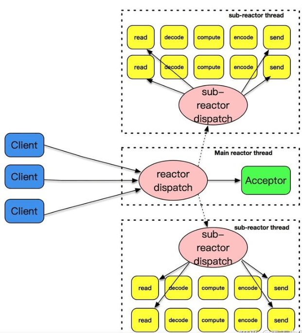
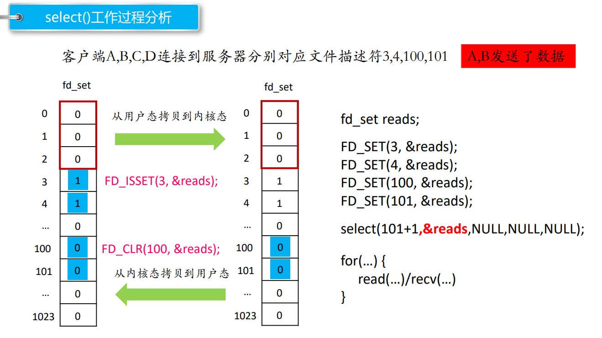
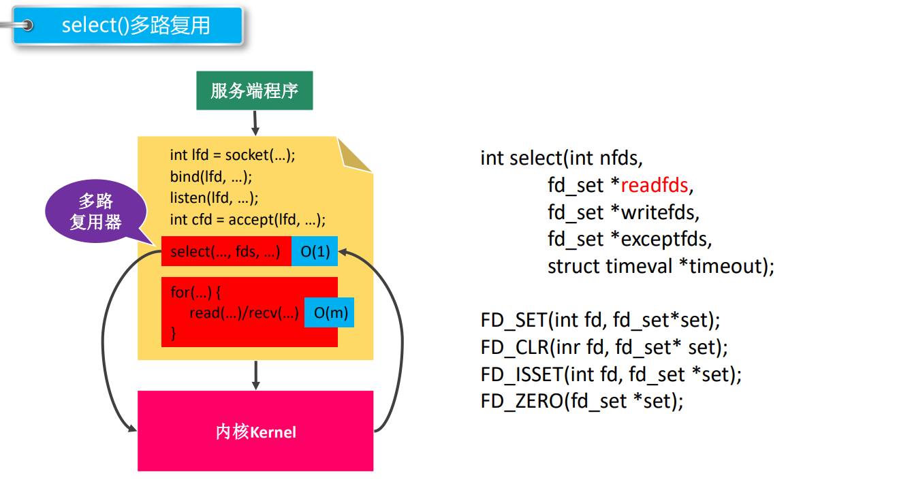
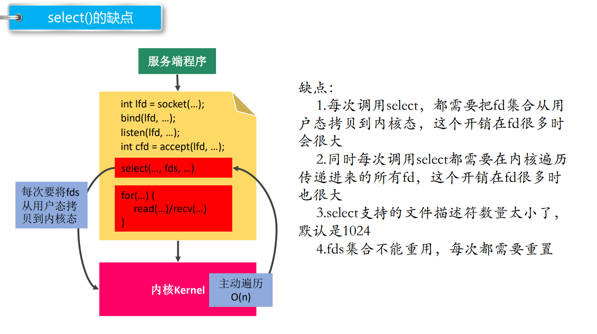
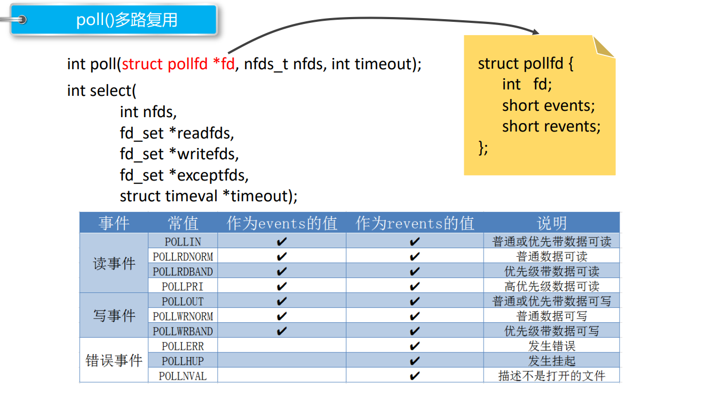
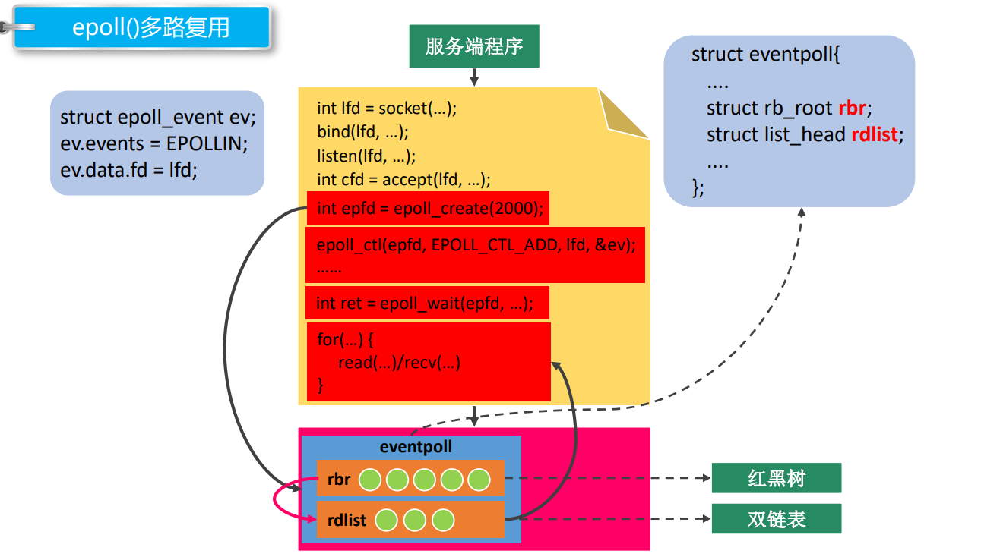

[TOC]


# 知识点

## Reactor、Proactor和主从Reactor

服务器程序需要处理三类事件:I/O事件，信号以及定时事件，事件处理模式如下:

- Reactor模式：要求主线程（I/O处理单元）只负责监听文件描述符上是否有事件发生（可读、可写），若有，则立即通知工作线程（逻辑单元），将socket可读可写事件放入请求队列，读写数据、接受新连接以及处理客户请求均在工作线程中完成。
- Proactor模式：将所有的I/O操作和接受新连接都交给主线程和内核来处理（进行读、写），工作线程仅负责处理逻辑，如主线程读完成后`users[sockfd].read()`，选择一个工作线程来处理客户请求`pool->append(users + sockfd)`。正常proactor是用异步I/O的这样的话，尽管是主线程读写，但是调用异步I/O后，由系统内核进行读写(完成后通知主线程)，所以并不会耽搁主线程。
- 主从Reactor模式:主反应堆线程(主Reactor)通过accept方法获取已连接的套接字，然后将已连接的套接字分配给从反应堆线程(从Reactor)



​	通常使用同步I/O模型（如`epoll_wait`）实现Reactor，使用异步I/O（如`aio_read`和`aio_write`）实现Proactor。但在此项目中，我们使用的是**同步I/O模拟的Proactor**事件处理模式。

## 同步I/O与异步I/O

​	同步I/O:可以设置阻塞模式和非阻塞模式。非阻塞模式，如果是网络I/O的情况下，如果调用read后，如果内核缓冲区没有数据就直接返回，如果有内核缓冲区中有数据，要将内核缓冲区中的数据放到用户缓冲区中，然后read再返回。对于阻塞模式，如果调用read后，内核缓冲区没有数据，就一直在这里等待，直到网卡把数据放到内核缓冲区中，再将内核缓冲区中的数据放到用户缓冲区中，再返回。**所以对于同步I/O，无论是阻塞还是非阻塞，都少不了从内核缓冲区复制到用户缓冲区这一步,是由应用程序来完成的。**同步I/O要求用户自行执行

​	异步I/O:调用读写操作后，无论是否是阻塞I/O，直接返回，然后系统帮着把网卡里的数据放到内核缓冲区中，再放到用户缓冲区中，然后通知处理，也就是说异步I/O比同步I/O少了等待从内核缓冲区中复制到用户缓冲区的这一步。

**总结**

同步I/O向应用程序通知的是I/O就绪事件，异步I/O向应用程序通知的是I/O完成事件。

### 同步I/O(阻塞)：


- 当调用 read 方法时，会阻塞着，此时内核会向磁盘发起 I/O 请求，磁盘收到请求后，便会寻址，当磁盘数据准备好后，就会向内核发起 I/O 中断，告知内核磁盘数据已经准备好；
- 内核收到 I/O 中断后，就将数据从磁盘控制器缓冲区拷贝到 PageCache 里；
- 最后，内核再把 PageCache 中的数据拷贝到用户缓冲区，于是 read 调用就正常返回了。

### 异步I/O：


- 前半部分，内核向磁盘发起读请求，但是可以**不等待数据就位就可以返回**，于是进程此时可以处理其他任务；
- 后半部分，当内核将磁盘中的数据拷贝到进程缓冲区后，进程将接收到内核的**通知**，再去处理数据；

## 服务器两种并发编程模式(网络并发模型，网络并发的设计模式)

### 半同步/半异步模式(变体是半同步/半反应堆模式)

参考博客:https://zhuanlan.zhihu.com/p/58860015?hmsr=toutiao.io&utm_medium=toutiao.io&utm_source=toutiao.io	

​	综上，也就是说当一个客户端发送请求的时候，整个服务端的逻辑一分为二。第一部分，接收请求数据是异步的；第二部分，在收完数据之后的处理逻辑是同步的。所谓半同步，半异步因此得名。(我觉得这和proactor一样啊)

​	HSHA模式十分依赖异步IO，然而实现真异步通常是比较困难，即便Linux有AIO系列API，但其实十分鸡肋，内部用pthread模拟，在这方面不如Windows的IOCP。而当时IO多路复用技术的发展，带给了人们新的思路，用IO多路复用代替异步IO，对HSHA进行改造。这就是『半同步/半反应堆』模型（Half-Sync/Half-Reactor，以下简称HSHR）。

​	**半同步/半反应堆模式**

​	循环之初，Polling API（select/poll/epoll/kqueue）只监听服务端socket，当监测到服务端socket可读，就会进行进行accept，获得客户端fd放入队列。也就是说和HSHA不同，HSHR的队列中存放的不是请求数据，而是fd。工作线程从队列中取的不是数据，而是客户端fd。和HSHA不同，HSHR将IO的过程侵入到了工作线程中。**工作线程的逻辑循环内从队列取到fd后，对fd进行read/recv获取请求数据，然后进行处理，最后直接write/send客户端fd，将数据返回给客户端**。可以看出来，这种IO的方式是一种Reactor模式，这就是该模型中，半反应堆（Half-Reactor）一词的由来。当然队列中存储的元素并不是简单的int来表示fd，而是一个结构体，里面除了包含fd以外还会包含一些其他信息，比如状态之类的。如果队列是数组，则需要有状态标记，fd是否就绪，是否已被消费等等。工作线程每次取的时候不是简单的竞争队首元素，而是也要判断一下状态。当然如果是链表形式的队列，也可以通过增删节点，来表示fd是否就绪，这样工作线程每次就只需要竞争队首了，只不过在每个连接频繁发送数据的时候，会频繁的增删相同的fd节点，这样的链表操作效率未必比数组高效。

### 领导者和追随者模式

领导者和追随者模式是多个工作线程轮流获得事件源集合，轮流监听、分发并处理事件的一种模式。在任意时间点，程序都仅有一个领导者线程，它负责监听I/O事件。而其他线程都是追随者，他们休眠在线程池中等待成为新的领导者。当前的领导者如果检测到I/O事件，首先要从线程池中推选出新的领导者线程，然后处理I/O事件。此时，新的领导者等待新的I/O事件，而原来的领导者则处理I/O事件，二者实现并发。

## epoll，select，poll区别？为什么用epoll

I/O 多路复用使得程序能同时监听多个文件描述符，能够提高程序的性能，Linux 下实现 I/O 多路复用的 系统调用主要有 select、poll 和 epoll。

#### select

1. 首先要构造一个关于文件描述符的列表，将要监听的文件描述符添加到该列表中。 

2.  调用一个系统函数，监听该列表中的文件描述符，直到这些描述符中的一个或者多个进行I/O 操作时，该函数才返回。

    a.这个函数是阻塞  b.函数对文件描述符的检测的操作是由内核完成的 

3. 在返回时，它会告诉进程有多少（哪些）描述符要进行I/O操作。

```c
// sizeof(fd_set) = 128 1024
#include <sys/time.h>
#include <sys/types.h>
#include <unistd.h>
#include <sys/select.h>
int select(int nfds, fd_set *readfds, fd_set *writefds, fd_set *exceptfds, struct timeval *timeout);
- 参数：
    - nfds : 委托内核检测的最大文件描述符的值 + 1
    - readfds : 要检测的文件描述符的读的集合，委托内核检测哪些文件描述符的读的属性
        - 一般检测读操作
        - 对应的是对方发送过来的数据，因为读是被动的接收数据，检测的就是读缓冲区
        - 是一个传入传出参数
    - writefds : 要检测的文件描述符的写的集合，委托内核检测哪些文件描述符的写的属性
    	- 委托内核检测写缓冲区是不是还可以写数据（不满的就可以写）
    - exceptfds : 检测发生异常的文件描述符的集合
    - timeout : 设置的超时时间
    struct timeval {
        long tv_sec; /* seconds */
        long tv_usec; /* microseconds */
    };
    - NULL : 永久阻塞，直到检测到了文件描述符有变化
    - tv_sec = 0 tv_usec = 0， 不阻塞
    - tv_sec > 0 tv_usec > 0， 阻塞对应的时间
    - 返回值 :
        -1 : 失败
        >0(n) : 检测的集合中有n个文件描述符发生了变化

void FD_CLR(int fd, fd_set *set);// 将参数文件描述符fd对应的标志位设置为0
int FD_ISSET(int fd, fd_set *set);// 判断fd对应的标志位是0还是1， 返回值 ： fd对应的标志位的值，0，返回0， 1，返回1
void FD_SET(int fd, fd_set *set);// 将参数文件描述符fd 对应的标志位，设置为1
void FD_ZERO(fd_set *set);// fd_set一共有1024 bit, 全部初始化为0
```







#### **poll**

```c
#include <poll.h>
struct pollfd {
    int fd; /* 委托内核检测的文件描述符 */
    short events; /* 委托内核检测文件描述符的什么事件 */
    short revents; /* 文件描述符实际发生的事件 */
};
struct pollfd myfd;
myfd.fd = 5;
myfd.events = POLLIN | POLLOUT;
int poll(struct pollfd *fds, nfds_t nfds, int timeout);
- 参数：
    - fds : 是一个struct pollfd 结构体数组，这是一个需要检测的文件描述符的集合
    - nfds : 这个是第一个参数数组中最后一个有效元素的下标 + 1
    - timeout : 阻塞时长
        0 : 不阻塞
        -1 : 阻塞，当检测到需要检测的文件描述符有变化，解除阻塞
        >0 : 阻塞的时长
    - 返回值：
        -1 : 失败
        >0 (n) : 成功,n表示检测到集合中有n个文件描述符发生变化

```



#### **epoll**

```c
#include <sys/epoll.h>
/* 创建一个新的epoll实例。在内核中创建了一个数据，这个数据中有两个比较重要的数据，一个是需要检
测的文件描述符的信息（红黑树），还有一个是就绪列表，存放检测到数据发送改变的文件描述符信息（双向链表）。*/
int epoll_create(int size);
- 参数：
    size : 目前没有意义了。随便写一个数，必须大于0
    - 返回值：
        -1 : 失败
        > 0 : 文件描述符，操作epoll实例的
typedef union epoll_data {
    void *ptr;
    int fd;
    uint32_t u32;
    uint64_t u64;
} epoll_data_t;

struct epoll_event {
    uint32_t events; /* Epoll events */
    epoll_data_t data; /* User data variable */
};
常见的Epoll检测事件：
    - EPOLLIN
    - EPOLLOUT
    - EPOLLERR
// 对epoll实例进行管理：添加文件描述符信息，删除信息，修改信息
int epoll_ctl(int epfd, int op, int fd, struct epoll_event *event);
- 参数：
    - epfd : epoll实例对应的文件描述符
    - op : 要进行什么操作
        EPOLL_CTL_ADD: 添加
        EPOLL_CTL_MOD: 修改
        EPOLL_CTL_DEL: 删除
    - fd : 要检测的文件描述符
    - event : 检测文件描述符什么事情
// 检测函数
int epoll_wait(int epfd, struct epoll_event *events, int maxevents, int timeout);
- 参数：
    - epfd : epoll实例对应的文件描述符
    - events : 传出参数，保存了发送了变化的文件描述符的信息
    - maxevents : 第二个参数结构体数组的大小
    - timeout : 阻塞时间
        - 0 : 不阻塞
        - -1 : 阻塞，直到检测到fd数据发生变化，解除阻塞
        - > 0 : 阻塞的时长（毫秒）
    - 返回值：
        - 成功，返回发送变化的文件描述符的个数 > 0
        - 失败 -1
```



**总结：**

- 对于select和poll来说，所有文件描述符都是在用户态被加入其文件描述符集合的，每次调用都需要将整个集合拷贝到内核态；epoll则将整个文件描述符集合维护在内核态，每次添加文件描述符的时候都需要执行一个系统调用。系统调用的开销是很大的，而且在有很多短期活跃连接的情况下，epoll可能会慢于select和poll由于这些大量的系统调用开销。
- select使用线性表描述文件描述符集合，文件描述符有上限；poll使用链表来描述；epoll底层通过红黑树来描述，并且维护一个ready list，将事件表中已经就绪的事件添加到这里，在使用epoll_wait调用时，仅观察这个list中有没有数据即可。
- select和poll的最大开销来自内核判断是否有文件描述符就绪这一过程：每次执行select或poll调用时，它们会采用遍历的方式，遍历整个文件描述符集合去判断各个文件描述符是否有活动；epoll则不需要去以这种方式检查，当有活动产生时，会自动触发epoll回调函数通知epoll文件描述符，然后内核将这些就绪的文件描述符放到之前提到的ready list中等待epoll_wait调用后被处理。
- select和poll都只能工作在相对低效的LT模式下，而epoll同时支持LT和ET模式。
- 综上，当监测的fd数量较小，且各个fd都很活跃的情况下，建议使用select和poll；当监听的fd数量较多，且单位时间仅部分fd活跃的情况下，使用epoll会明显提升性能。


### epoll一定比select效率高吗？

​	高并发场景用epoll非select，主要是select的bitmap size，能监控的fd大小最多1024， 限制僵硬。

### epoll对文件操作描述符的模式：LT（水平触发）和ET（边缘触发）

- LT（电平触发）：类似`select`，LT会去遍历在epoll事件表中每个文件描述符，来观察是否有我们感兴趣的事件发生，如果有（触发了该文件描述符上的回调函数），`epoll_wait`就会以非阻塞的方式返回。若该epoll事件没有被处理完（没有返回`EWOULDBLOCK`），该事件还会被后续的`epoll_wait`再次触发。
- ET（边缘触发）：ET在发现有我们感兴趣的事件发生后，立即返回，并且`sleep`这一事件的`epoll_wait`，不管该事件有没有结束。

在使用ET模式时，必须要保证该文件描述符是非阻塞的（确保在没有数据可读时，该文件描述符不会一直阻塞，因为ET只会通知一次，要循环调用read，一次全读完，所以如果是阻塞read，最后读完会阻塞住）；并且每次调用`read`和`write`的时候都必须等到它们返回`EWOULDBLOCK`（确保所有数据都已读完或写完）。

ET 模式在很大程度上减少了 epoll 事件被重复触发的次数，因此效率要比 LT 模式高。

## 线程安全的hash表threadsafe_lookup_table

	线程安全的查找结构，实现一个类似线程安全的map结构，但是map基于红黑树实现，假设我们要增加或者删除节点，设计思路是依次要删除或增加节点的父节点，然后修改子节点数据 。尽管这种思路可行，但是难度较大，红黑树节点的插入要修改多个节点的关系。另外加锁的流程也是锁父节点，再锁子节点，尽管在处理子节点时我们已经处理完父节点，可以对父节点解锁，继续对子节点加锁，这种情况锁的粒度也不是很精细，考虑用散列表实现。对于链表的增删改查需要加锁,所以考虑将链表封装为一个类`bucket_type`,支持数据的增删改查。将整体的查找表封装为`threadsafe_lookup_table`类，实现散列规则和调度`bucket_type`类。

​	在`threadsafe_lookup_table`类中定义`bucket_type`类，并在`bucket_type`中将`threadsafe_lookup_table`设置为友元类。在`bucket_type`类中定义一个链表，链表中存放的是pair的键值对。为保证读并发定义了一个读写锁`shared_mutex`。

```c++
using bucket_value = std::pair<Key, Value>;             // 存储元素的类型为pair 由key和value构成
using bucket_data = std::list<bucket_value>;            // 用链表存储元素
using bucket_iterator = typename bucket_data::iterator; // 链表的迭代器
bucket_data data;                                       // 链表数据
mutable std::shared_mutex mutex;                        // 共享锁 单个桶内用共享锁 可以并发读 互斥写
//在bucket_type内部定义以下函数
bucket_iterator find_entry_for(const Key & key)//内部私有查找函数  返回迭代器
Value value_for(Key const& key, Value const& default_value)//查找函数
void add_or_update_mapping(Key const& key, Value const& value)//添加key和value，找到则更新，没找到则添加
void remove_mapping(Key const& key)//删除对应的key
```

`threadsafe_lookup_table`类里用`vector`存储`bucket_type`的指针 然后利用`std::hash`作为默认hash算法

```c++
std::vector<std::unique_ptr<bucket_type>> buckets; //用vector存储桶类型
Hash hasher;    //hash<Key> 哈希表 用来根据key生成哈希值
bucket_type& get_bucket(Key const& key) const////根据key生成数字，并对桶的大小取余得到下标，根据下标返回对应的桶
Value value_for(Key const& key, Value const& default_value = Value()) //先根据key找到对应桶 然后调用底层桶的查找
void add_or_update_mapping(Key const& key, Value const& value)//先根据key找到对应桶 然后调用底层桶的加入函数
void remove_mapping(Key const& key)//先根据key找到对应桶 然后调用底层桶的删除函数
std::map<Key, Value> get_map()//把所有的pair放入map中返回
```

## 面试问题

### 为什么做这个项目

看过游双的Linux高性能服务器编程，想把书上的内容实践一下。

### 项目介绍

​	这个项⽬是我在学习Linux 网络编程编程过程中开发的轻量级Web服务器。

​	服务器的模型是proactor加线程池的模式，用到了IO多路复用技术，处理多个客户端的http请求，访问服务器上的图片，支持get和post。然后进行了一些优化，用C++11标准线程库实现的线程池，实现了线程安全的查找表存储用户的账户名和密码，实现了LFU缓存文件，实现了内存池进行内存分配，提高内存分配效率。

### 压力测试

命令:webbench -c 10500 -t 5 http://114.115.203.46:9006/

如果

### 线程的同步机制有哪些？

信号量，条件变量，互斥量等；

条件变量:一个线程等待某个条件为真，将自己挂起；另一个线程使得条件成立，并通知等待的线程继续，条件变量要和互斥锁一起使用。如果生产者线程进行notify的时候，消费者线程还没有处于wait状态，会出现<font color = "red">**唤醒丢失**</font>，由于错过了唤醒信号，消费者可能会一直等待。加个flag记录状态既可以解决，condition_variable的wait的参数中加个lambda表达式，判断flag状态。

信号量:最主要的是可以指明可用资源的数量。

**条件变量和信号量的最大区别就是，条件变量可以一次唤醒所有的线程，信号量一次只能唤醒一个线程。**

### 如果同时1000个客户端进行访问请求，线程数不多，怎么能即使相应处理每个？

不是每个客户连接对应一个线程，当有任务需要处理时，主线程会将任务加入到任务队列，线程进行竞争执行。还是慢，可以增大线程池里的线程数量，或者考虑集群分布式，交给其他服务器处理。

### 如果一个客户请求要占用线程很久的时间，会不会影响接下来的客户请求呢，有什么策略？

会影响，客户请求长时间占用线程资源，会影响到服务器整体的相应速度。1.可以给每个线程设定时间，类似操作系统时间片 2.直接断开连接

### 说一下服务器使用的并发模型？

**使用的是半同步半反应堆的并发模型**，采用的是同步I/O模拟的proactor，主线程充当异步线程，负责监听socket上的事件，接受新连接，读写数据，然后将数据放到队列上，当工作队列上任务到来，工作线程竞争处理业务逻辑。

### HTTP报文解析相关

#### 为什么用状态机

